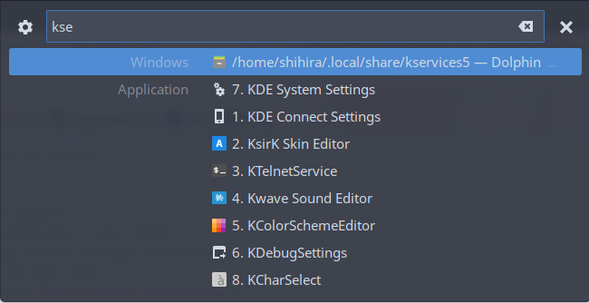

# KRunner Bridge

**Write krunner python plugins the quick way.**

<del>Plasma 5 stopped exposing KDE Framework API to script languages (except QML) for the purpose of so-called stability (but it is not at all stable, crashing from time to time). But this brings some horrible consequence that writing krunner plugins becomes time-consuming. You have to write long C++ code, configure your C++ building toolchain, and compile them each time you modify something.</del>

No more pains with ONE plugin for all.

-----

UPDATE: A KDE maintainer has described a way that was newly introduced in KDE 5.11, to make use of DBus to achieve this. See this post: http://blog.davidedmundson.co.uk/blog/cross-process-runners/

## Installation

Requirements:

* Python 3.x
* KF5 & Qt5

Clone this repository to local filesystem and cd into it.

```sh
mkdir build
cd build

cmake ..
make
make install
```

## Quick Start

We will try to write a basic calculator using python's eval function.

Follow the installation instructions and then edit `~/.local/share/kservices5/example_calc.py`:

```python
#!/usr/bin/env python

import krunner_bridge
from math import *

@krunner_bridge.match_handler
def match(query):
    try:
        res = eval(query)
        if isinstance(res, (int, float)):
            return krunner_bridge.datasource(
                text=str(res),
                icon="accessories-calculator",
                category="Python Calculator")
    except:
        pass

if __name__ == "__main__":
    krunner_bridge.exec()
```

Append one line to `~/.local/share/kservices5/krunner_bridge.desktop`, which tells krunner bridge where to find your script.

```
echo X-KRunner-Bridge-Script-1=example_calc.py >> $HOME/.local/share/kservices5/krunner_bridge.desktop
```

Kill and restart krunner. (NOTE: It would be more debuggable to run it in terminal than using `kstart5`. All stderr output from your python script will be forwarded and displayed.) That's what it will be like when all's done:


For more practical examples, check out `example_search.py` and view the effects by running `./install_examples.sh`. It searches in my useful little scripts and applications, with far better fuzzy match algorithm and selection mechanism. As what shows below, when you type one more key `5` to form a query `kse5`, the 5th choice `KColorSchemeEditor` will automatically be selected.



## API

* `exec()`: The entry of a script
* `match_handler`: Register a function having parameter `query` and returning a list of `datasource` as a match handler
* `init_handler`: Register a function having no parameter as an init handler
* `run_handler`: Register a function having parameter `data` as a run handler
* `datasource`
    - Properties:
        - data: Save a dict/array/string/numeric here for later use (in run handler)
        - text: Display text
        - cmp: String for matcher comparison
        - icon: Icon name. check them in `kdialog --geticon`
        - category: Display category text
        - relevance: For result sorting in krunner
    - Methods:
        - `from_files(glob_pattern, icon, cat="")`: Collect files matching glob_pattern
        - `from_desktop(glob_pattern, cat="")`: Collect applications matching glob_pattern, icons are extracted from desktop files
        - `fuzzy_match(query_string)`: Better matching algorithm. Returns a bool.

## FAQs

* Q: How does it work actually?
* A: The C++ plugin just calls python scripts throw spawning subprocess, and passes parameters like `{"operation":"query","query":"kss"}` through standard input, while the script parses this and returns the result set through standard output, formatted in JSON likewise. This mean you can write the script in any language (even bash) as long as you can parse JSON. To note that the script is called everytime there is an action (run/query/init), so make your script finished as quickly as possible, and do not keep alive in background.

* Q: What if I want multiple scripts?
* A: Just append one more line `X-KRunner-Bridge-Script###=<path/to/your/script>`, where ### can be a number, an ID or anything unique. KRunner bridge searches all properties starting with `X-KRunner-Bridge-Script` and run them one after another. Distinguish them with the category property.

-----

* Q: Is it possible to move my scripts somewhere else?
* A: Yes. Scripts are not required to be in the services directory, for this is just a default searching path. Just specify the right path, adn remember to quote special characters.

-----

* Q: How can I make some cache to speed up searching?
* A: Do initialization and slow tasks in `init`, And handle caches by your own. For example, `pickle` your data up and save them in `/tmp`. `datasource` the python class provide some method to generate results, which might be useful.

-----

* Q: I got an error like "The shared library krunner_bridge.so was not found.", how can I resolve it? (#2)
* A: This may be caused by the misconfigured Qt plugin search path. For user specific path it is usually set to `~/.local/lib/qt/plugins/` (as is done in the cmake build script) in most \*nix dists but some are not. If this problem comes to you, try to set this path to env-var by exporting `export QT_PLUGIN_PATH=~/.local/lib/qt/plugins/`. To ensure it works globally, add it to `.bashrc` or `~/.config/plasma-workspace/env/`.
